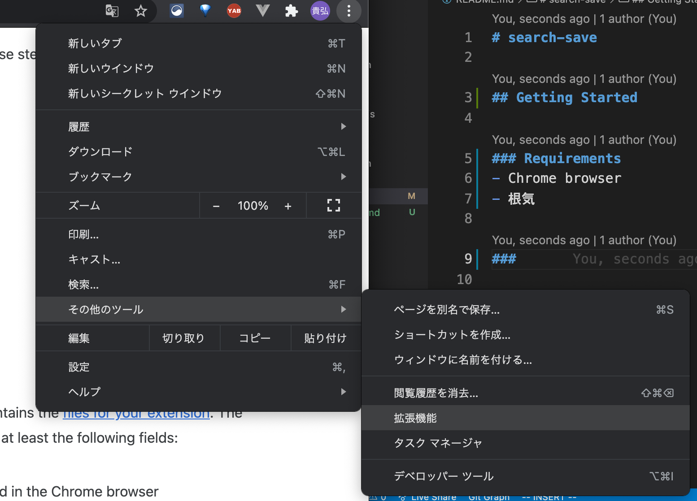
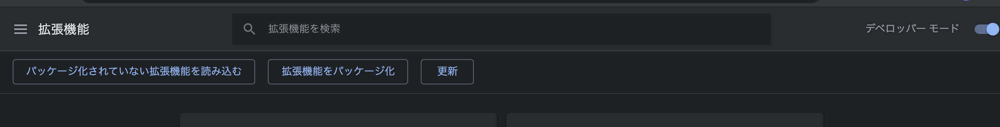
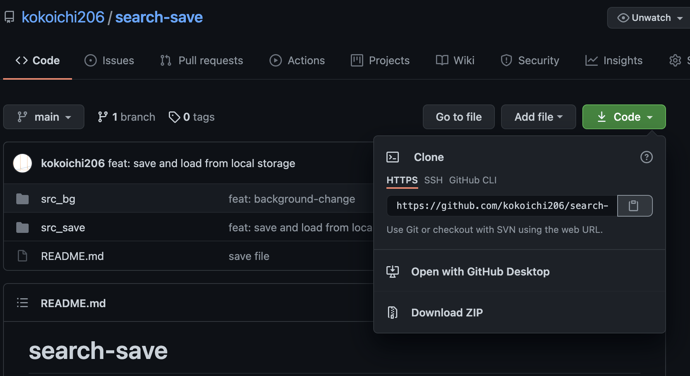
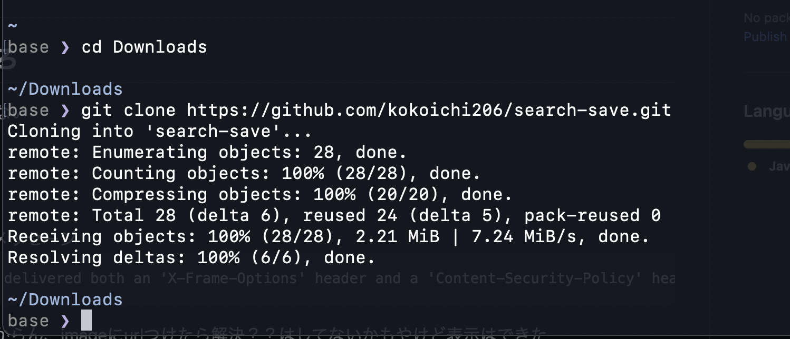

# search-save

## Getting Started

### Requirements
- Chrome browser
- 根気

### 自作拡張機能インストール方法
- Chromeの右上の3点リーダー → その他ツール → 拡張機能


- 右上のデベロッパーツールをONにする
- 「パッケージ化されていない拡張機能を読み込む」をクリックし、自作拡張機能を読み込む


### このリポジトリの拡張機能を使う場合
- 緑の"Code"ボタン → URLの右のクリップボードをクリックしてURLをコピー



- 保存したい場所で以下のコマンドを実行（この場合、コピーいらない）
```
git clone https://github.com/kokoichi206/search-save.git
```
- 下のは`Downloads`フォルダにクローンした場合




## src_bg

## src_save
